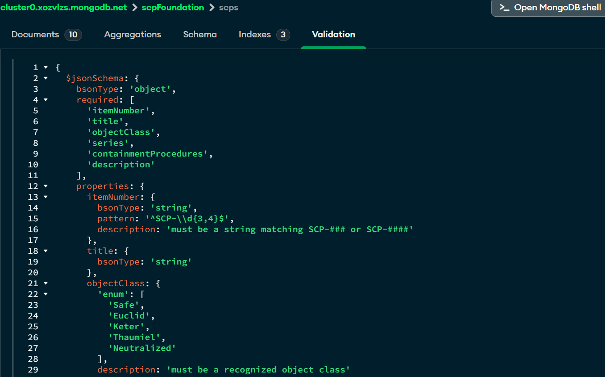

# SCP Foundation Database API

A RESTful API for cataloguing SCP Foundation anomalies, Foundation personnel, and
containment incident reports. Built with Node, Express 5, MongoDB Atlas, and Mongoose.

This is an **ongoing project**. SBA 319 covers the database and API foundation; the
longer-term goal is a full application built around the SCP Series: future ideas
include an interactive site map of Foundation facilities, aggregation-powered stats
(casualties per SCP, incidents by severity over time), coverage of more of Series I,
and eventually a front end for browsing the containment database. 
**Big Shout out to Quinn Shannon for the idea**

## Tech Stack

- **Node.js** with ES modules (`"type": "module"`) enables top-level `await`
- **Express 5** - async route errors forward automatically to central error middleware
- **MongoDB Atlas** - cloud-hosted database
- **Mongoose** - schemas, validation, indexes, queries, and refs/populate

## Getting Started

1. `npm install`
2. Create a `.env` file in the project root:
ATLAS_URI=mongodb+srv://<user>:<password>@<cluster>.mongodb.net/scpFoundation?retryWrites=true&w=majority
PORT=3000
3. `npm run seed` - populates all three collections (wipes first; safe to re-run)
4. `npm run validate:db` - applies database-level $jsonSchema validation via collMod
5. `npm run dev` - starts the server with auto-restart on file changes

## Collections & Data Model

| Collection | Purpose | Notable fields |
|---|---|---|
| `scps` | Anomaly records | `itemNumber` (unique), `objectClass` (enum), `series`, `rating` |
| `personnels` | Foundation staff | `designation` (enum), `clearanceLevel` (1–5), `site`, `active` |
| `incidentreports` | Containment incidents | `scp` (ref), `reportedBy` (ref), `severity` (enum), `occurredAt` |

Incident reports **reference** SCPs and personnel by ObjectId rather than embedding
them — incidents grow without bound over time, and unbounded embedded arrays are a
MongoDB anti-pattern. GET routes use `.populate()` to resolve refs into readable
subdocuments.

## API Routes

### /scps

| Method | Route | Description |
|---|---|---|
| GET | `/scps` | List all SCPs. Filters: `?objectClass=Keter`, `?series=1` |
| GET | `/scps/:id` | Get one SCP by id |
| POST | `/scps` | Create an SCP (runs both validation layers) |
| PATCH | `/scps/:id` | Update an SCP (`runValidators` enabled) |
| DELETE | `/scps/:id` | Delete an SCP |

### /personnel

| Method | Route | Description |
|---|---|---|
| GET | `/personnel` | List personnel. Filters: `?site=Site-19`, `?designation=Researcher`, `?minClearance=3`, `?active=true` |
| GET | `/personnel/:id` | Get one personnel record by id |
| POST | `/personnel` | Create a personnel record |
| PATCH | `/personnel/:id` | Update a personnel record |
| DELETE | `/personnel/:id` | Delete a personnel record |

### /incidents

| Method | Route | Description |
|---|---|---|
| GET | `/incidents` | List incidents, newest first, refs populated. Filters: `?severity=Severe`, `?scp=<objectId>` |
| GET | `/incidents/:id` | Get one incident by id, refs populated |
| POST | `/incidents` | Create an incident (body supplies `scp` and `reportedBy` ObjectIds) |
| PATCH | `/incidents/:id` | Update an incident |
| DELETE | `/incidents/:id` | Delete an incident |

**Error responses:** `400` malformed id or failed validation (custom messages),
`404` well-formed id with no match, `409` duplicate unique key, `500` server fault.

## Indexes

| Collection | Index | Serves |
|---|---|---|
| scps | `itemNumber` (unique) | Uniqueness + direct lookup |
| scps | `objectClass` | `?objectClass=` filters |
| scps | `series, objectClass` (compound) | `?series=` alone or combined (prefix rule) |
| personnels | `site, clearanceLevel desc` (compound) | Site rosters, clearance sorting |
| incidentreports | `scp, occurredAt desc` (compound) | "All incidents for one SCP, newest first" |

The `rating` field on scps is **deliberately un-indexed**: on a live site it would
update constantly, and the high write-to-read ratio means index maintenance on every
vote would cost more than faster reads would save.

## Validation (two layers)

**Application layer (Mongoose):** required fields, enums with custom messages,
regex `match` on `itemNumber`, min/max on `clearanceLevel`, `maxLength` on summaries.
Runs on create and — because every PATCH sets `runValidators: true` on update.

**Database layer ($jsonSchema):** `scripts/applyDbValidation.js` applies mirrored
rules directly to the `scps` collection via `collMod`, with
`validationLevel: 'strict'` and `validationAction: 'error'`. These rules live inside
MongoDB and reject invalid writes from *any* client, not just this app. The script
proves it by inserting an invalid document through the raw driver (bypassing Mongoose
entirely) and confirming the database rejects it with error code 121.

The `scps` collection's `$jsonSchema` validator, shown in MongoDB Compass:

**To test validation through the API:** `POST /scps` with `"objectClass": "Apollyon"`
→ `400` with the enum's custom message. `POST /scps` reusing an existing `itemNumber`
→ `409` from the database's unique index.

## Development Notes — tricky parts and lessons learned

**npm scripts live inside `"scripts"`.** I added `"validate:db"` as a top-level
`package.json` property and got `Missing script` npm ignores unknown top-level keys
without complaint, so nothing looked wrong. `npm run` (no arguments) lists what's
actually registered; that's the fast way to check.

**Booleans from URL query parameters.** Every value in `req.query` is a string, so
`?active=false` arrives as `"false"` which is truthy. Filtering personnel by active
status required an explicit comparison (`filter.active = req.query.active === 'true'`)
plus an `!== undefined` guard so the filter only applies when the parameter is present
at all. Numbers have the same problem: `?minClearance=3` needs `Number()` before it
can be used in a `$gte`.

**Mongoose queries are lazy parentheses change everything.**
`(await Personnel.find(filter)).sort({...})` resolves the query first, returning a
plain array, then calls `Array.prototype.sort` with an object: a TypeError.
`await Personnel.find(filter).sort({...})` chains `.sort()` onto the query so MongoDB
does the sorting (using the index). Two characters apart, completely different
execution.

**Sorting on a misspelled field fails silently.** `.sort({ occuredAt: -1 })` (missing
an "r") threw no error: MongoDB happily sorts on a nonexistent field, every document
ties, and results come back in insertion order. Found it only by checking the actual
dates in the response.

**`findByIdAndUpdate` skips validators by default.** Without `runValidators: true`,
a PATCH could write values straight past the schema's enum. Every update route sets it.

**Re-seeding regenerates every `_id`.** The seed script wipes collections first, so
any ObjectId saved in Thunder Client history or notes goes stale after a re-run.
Fresh ids come from a live GET each session.

**Database validation can't reject Mongoose's own bookkeeping.** The $jsonSchema
deliberately omits `additionalProperties: false` Mongoose writes `__v`, and
timestamps add `createdAt`/`updatedAt`, none of which are in the schema's property
list. Locking down unknown properties would reject every legitimate write.

**Ordered inserts stop at the first failure.** `insertMany` hit a duplicate
`itemNumber` mid-array during seeding and stopped there, leaving partial data: the
wipe-first design made that recoverable with a single re-run.

## Attribution

SCP names, object classes, and containment concepts are based on the
[SCP Foundation wiki](https://scp-wiki.wikidot.com/), licensed under
[CC BY-SA 3.0](https://creativecommons.org/licenses/by-sa/3.0/). Incident summaries
and personnel are original to this project. This project is unofficial fan work.
